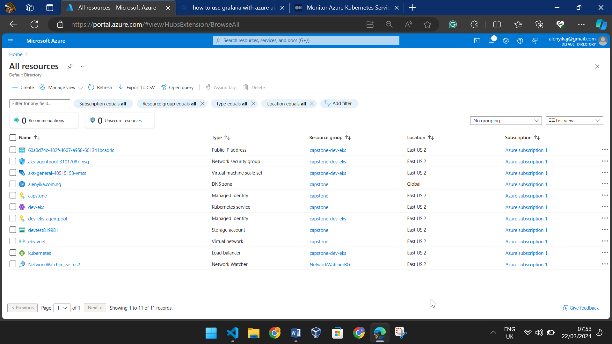

# DEPLOYMENT OF A MICROSERVICE-BASED APPLICATION USING AUTOMATED TOOLS.
This project deployed a microservices-based application using Jenkins and terraform to ensure quick, reliable, and secure deployment on Kubernetes. By focusing on Infrastructure as Code, Using terraform to create a reproducible and maintainable deployment process that leverages modern DevOps practices and tools.


# INFRASTRUCTURE

## Overview

This directory contains the infrastructure code for the AKS cluster and the Azure resources that are used by the application. The infrastructure is defined using Terraform 


## Prerequisites
Terrafrom
Azure
Grafana and Prometheus
Kubernetes CLI

## Testing

- To test the infrastructure code, you can run the following commands:

  ```bash
  cd Azure
  terraform init
  terraform plan
  terraform apply -auto-approve
  ```

- The `terraform init` command is used to initialize the working directory and to download the provider plugins. The `terraform plan` command is used to create an execution plan. The `terraform apply` command is used to apply the changes required to reach the desired state of the configuration.

- The commands above create the infrastructure defined in the terraform file. 


 
- To test the AkS cluster, run;

  ```bash
  az aks get-credentials --resource-group <resource-group-name> --name <aks-cluster-name>
  kubectl get nodes
  ```


- The `az aks get-credentials`  check the access credentials for the AKS cluster. The `kubectl get nodes` list the nodes in the AKS cluster. Here is a screenshot of the nodes in the AKS cluster after running the above commands:

  


# 2. INGRESS
### Nginx Ingress Controller

The Nginx Ingress Controller `external-nginx` namespace and routes traffic to the sock-shop microservices. The controller also works as a load balancer and reverse proxy for the sock-shop microservices.

To deploy the Nginx Ingress Controller, use the following command:

```bash
kubectl apply -f ingress.yaml
```

### Sock Shop Ingress

The Sock Shop Ingress routes traffic from the Internet to the microservices. It is deployed to the `sock-shop` namespace and defines the desired state of the application. The Sock Shop Ingress is defined in the `sock-shop.yml` file.

To deploy the Sock Shop Ingress, use the following command:

```bash
kubectl apply -f sock-shop.yml
```


 Before deploying, the `sock-shop` namespace, ensure ingress is correct. Additionally, the certificate issuer should be deployed first.

## Testing

After the Nginx Ingress Controller and Sock Shop Ingress are deployed, the ingress can be assessed through URL provided in the ingress resource. For example, the host is `sock-shop.alenyika.com.ng,`  visit the URL `https://sock-shop.alenyika.com.ng/catalogue` to test the ingress.


# 3. Monitoring


## Prometheus

The `Prometheus`  contains manifest files for deploying the Prometheus instance to the Kubernetes cluster. The Prometheus instance is configured with the necessary rules and alerts to monitor the applications.

### Image of the Prometheus instance after deployment


## Grafana

The `Grafana` directory contains manifest files for deploying Grafana to the Kubernetes cluster. Grafana is used to visualize the metrics collected by Prometheus. Grafana is configured with the necessary dashboards and panels to visualize the metrics.

### Image of the Grafana instance after deployment


In this example, the Grafana instance is configured with the Prometheus data source and the grafana dashboard.

## Alertmanager

The `Alertmanager` define the alerts that is be sent to the receivers. 

### Image of the Alertmanager instance after deployment


The alert manager has been set to send alert to my slack channel.


## Cleanup

- To clean up resources,

  ```bash
  terraform destroy -auto-approve
  ```
